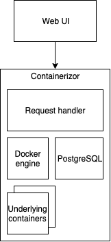
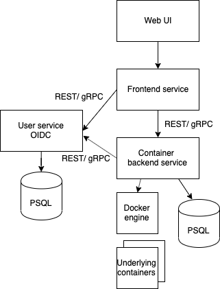

# containerizor

This is a sample web service, whose purpose is to manage Docker containers. 'Manage' meaning:
- start a new container from a given image name
- stop a running container
- start a stopped container
- exec a command into a running container and showing the output of the command

# Architecture

Currently, the service is a monolith, one service that does everything. Put into picture it looks like this: 

The web UI of the service is powered by Go templates, and the actions executed by the user are POST request powered by HTML forms.
The reasons I did it that way are two:
1. I had never build anything using Go templates, but had heard they are powerful and well-designed, so really wanted to try it out.
2. I really did not want to write any JS for this project. I have little knowledge of React, Angular is overkill for a project this size and jQuery is just a no.

This is not ideal, and I would like to change it, however, it was the fastest way to start and I wanted to keep it simple in the beggining.
Given the timeframe, I did not had time to refactor it. In my opinion, a proper architecture for this requirements would be something like this:
A front-end service, whose only job is to render the HTML templates and communicate with the container back-end and login service.
A login service to store user identity, ideally a OIDC provider, which would allow easily to integrate with "Login with Google", "Login with Facebook", etc.
A container back-end service, that will do the actual managing of containers.

The higher point of it all may be the option to add more nodes on which to schedule containers (basically implementing Kubernetes).

# Multi-tenancy

My implementations of multi-tenancy (that is, a user only sees his containers) is simple. For the purpose, I am using
PostgreSQL schemas. Every user has its own schema, and in that schema is stored the information about the user's containers.
When listing containers, the service will fetch all containers via the Docker API and filter only those that are present in the given user's DB records.
That said, this feature is still WIP (see below).

# Known issues

The service at this point has a lot of known issues:
- missing proper FE validations of user input
- minimal input validation on the BE
- minimal error handling. For instance, if you try to register an existing user name, you will be redirected to a blank page that says "username already exists" (who cares about UX, right)
- the multi-tenancy is still not working. You can register and login an user, but the cookie that will be returned to you looks like this: `token: TODO`
- that said, anyone with access to the system can start, stop and exec in anyone else's containers (again, time limitations and bad planning on my side)

# How to start

## Prerequisites:
0. Run PostgreSQL
00. Create a new database
000. Run `sql/init.sql` into the database

## Actual setup
1. `$ go run ./cmd/web -port=<APPLICATION_PORT> -db_host=<DB_HOST> -db_port=<DB_PORT> -db_user=<DB_USER> -db_name=<DB_NAME> -db_pass=<DB_PASS(optional)>`

NOTE: The service has a Docker container, and I tried making the setup a bit easier by adding a `docker-compose.yml` which will handle the above steps for you, but I was short on time. I think that I will get this up and running in a few days when I have the time to debug all the nasty problems I get while trying to run it.